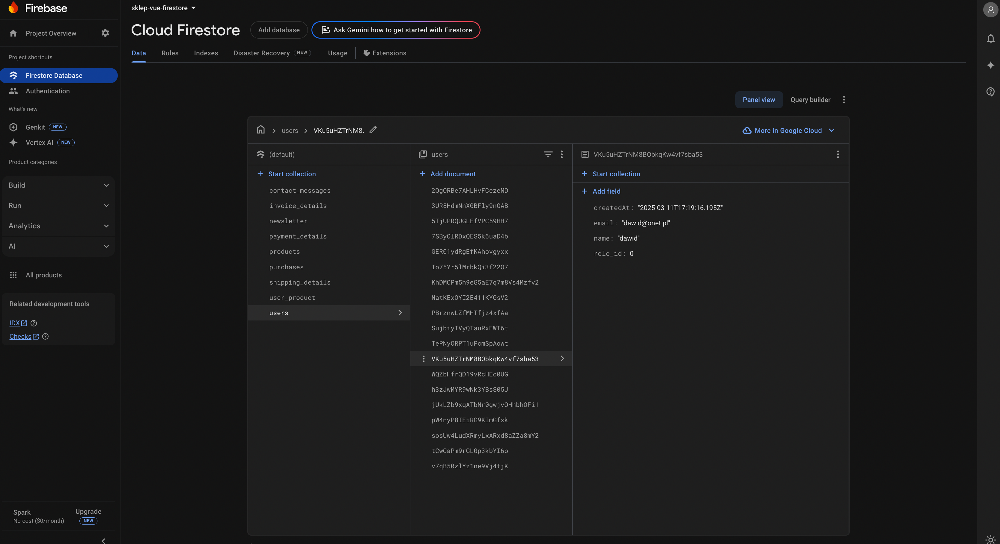

# Shop-Vue-Firestore-Demo

Shop-Vue-Firestore-Demo is a modern, responsive e-commerce demo application built with **Vue 3** and **Firebase Firestore**. It demonstrates a complete shop system with product management, user and admin panels, cart functionality, checkout processes, newsletter subscription, and a contact form—all powered by Firestore for data storage.

The front end of this project is built using a ready-made W3Schools template. You can view the original template at [W3Schools Clothing Store Template](https://www.w3schools.com/w3css/tryw3css_templates_clothing_store.htm).


## Table of Contents

- [Features](#features)
- [Technologies Used](#technologies-used)
- [Getting Started](#getting-started)
- [Project Structure](#project-structure)
- [Docs Directory](#docs-directory)
- [Database Directory](#database-directory)
- [Usage](#usage)
- [Firebase Setup](#firebase-setup)
- [License](#license)
- [Contact](#contact)

## Features

- **Product Listing & CRUD**:
  - Display a list of products fetched from Firestore.
  - Admin panel enables creating, editing, and deleting products (with pagination: 10 products per page).
- **Cart & Checkout**:
  - Users (both guests and logged in) can add products to their cart.
  - Checkout process includes shipping, invoice, and payment details.
- **User & Admin Panels**:
  - **User Panel**: Displays purchased products grouped by purchase date, with an option to view shipping details.
  - **Admin Panel**: Allows product management (add, edit, delete) and viewing of contact messages.
- **Newsletter & Contact Forms**:
  - Footer forms for newsletter subscription and contacting support.
  - Data for newsletter subscriptions and contact messages are stored in dedicated Firestore collections.

## Technologies Used

- **Vue 3** – Modern JavaScript framework for building user interfaces.
- **Firebase Firestore** – NoSQL database used for storing all application data.
- **Vite** – A fast development server and build tool for modern web projects.
- **Pinia** – State management library for Vue 3.
- **CSS** – Custom responsive styles for a modern look and feel.

## Getting Started

Follow these steps to get the project up and running on your local machine:

1. **Clone the Repository**

   ```bash
   git clone https://github.com/dawidolko/Shop-Vue-Firestore-Demo.git
   cd Shop-Vue-Firestore-Demo
   ```

2. **Install Dependencies**

   ```bash
   npm install
   ```

   or

   ```bash
   yarn install
   ```

3. **Configure Firebase**

   - Go to the [Firebase Console](https://console.firebase.google.com/) and create a new project.
   - Enable **Firestore** under _Build → Firestore Database_.
   - Copy your Firebase config (apiKey, authDomain, projectId, etc.) into your project configuration (typically in `src/firebase.js`).
   - Ensure your Firestore security rules allow the operations needed for this demo (for development, you might set open rules—but remember to tighten them for production).

4. **Run the Development Server**

   ```bash
   npm run dev
   ```

   or

   ```bash
   yarn dev
   ```

   By default, the application will run at `http://localhost:5173/`.

## Project Structure

A typical structure of the project looks like this:

```
Shop-Vue-Firestore-Demo/
├─ docs/
│  └─ img/
│     └─ app.png         # Screenshot of the application
├─ database/
│  ├─ users.json
│  ├─ products.json
│  ├─ user_product.json
│  ├─ purchases.json
│  ├─ shipping_details.json
│  ├─ invoice_details.json
│  ├─ payment_details.json
│  ├─ newsletter.json
│  └─ contact_messages.json
├─ public/
├─ src/
│  ├─ assets/
│  │  └─ styles/         # CSS files
│  ├─ components/
│  │  ├─ Checkout.vue    # Checkout form component
│  │  └─ ...             # Other reusable components
│  ├─ views/
│  │  ├─ HomeView.vue
│  │  ├─ CartView.vue
│  │  ├─ ProductDetailView.vue
│  │  ├─ CategoryView.vue
│  │  ├─ BrandView.vue
│  │  ├─ Auth/
│  │  │  ├─ LoginView.vue
│  │  │  ├─ RegisterView.vue
│  │  │  ├─ PanelView.vue  # Admin/User panel
│  │  │  └─ SettingsView.vue
│  │  └─ ...
│  ├─ firebase.js         # Firebase configuration
│  ├─ router/
│  │  └─ index.js
│  ├─ stores/
│  │  └─ auth.js
│  ├─ App.vue
│  └─ main.js
├─ package.json
├─ vite.config.js
└─ README.md
```

### Docs Directory

The **docs** directory contains documentation and visual assets for the project. You can store screenshots (for example, `docs/img/app.png`), design mockups, or additional guides here.

### Database Directory

The **database** directory holds JSON files with sample data for Firestore collections. These files can be imported using a script (e.g., `importData.js`) to quickly populate your Firestore database with initial data. The JSON files include data for collections such as:

- `users`
- `products`
- `user_product`
- `purchases`
- `shipping_details`
- `invoice_details`
- `payment_details`
- `newsletter`
- `contact_messages`

## Usage

### For Users

- **Product Browsing & Cart:**  
  Browse through products, add them to the cart, and complete the checkout process.
- **User Panel:**  
  View purchased products grouped by purchase date. Click “Shipping Details” to see shipping information (sourced from purchase data or invoice details).

### For Administrators

- **Admin Panel:**  
  Log in as an admin (role_id = 1) to access the Admin Panel:
  - **Manage Products:**
    - Add new products via the form.
    - Edit or delete existing products.
    - Pagination displays 10 products per page.
  - **Contact Messages:**
    - View messages submitted through the contact form from the footer.

## Firebase Setup

Before running the project, make sure you have:

- Configured Firebase in your project (see **Getting Started**).
- Created the following Firestore collections:
  - `products`
  - `purchases`
  - `shipping_details`
  - `invoice_details`
  - `payment_details`
  - `newsletter`
  - `contact_messages`

For testing data import, you can use a script like `importData.js` with the JSON files located in the `database` directory.



## License

This project is open-source and available under the [MIT License](LICENSE). Feel free to use, modify, and distribute it as needed.

## Contact

If you have any questions or suggestions, please open an issue on GitHub or contact me directly.

Enjoy building your shop with Vue 3 and Firebase Firestore!
