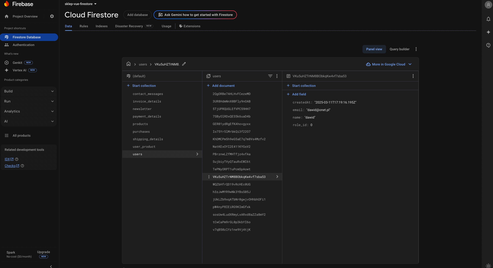

# Shop-Vue-Firestore-Demo  

> 🚀 **Modern E-Commerce Platform with Firebase** - Build full-featured online stores with Vue 3, Firestore database, and real-time data synchronization

## 📋 Description

Welcome to the **Shop-Vue-Firestore-Demo** repository! This modern, responsive e-commerce application demonstrates a complete shop system built with Vue 3 and Firebase Firestore. The platform features comprehensive product management, user and admin panels, shopping cart functionality, checkout processes, newsletter subscription, and contact forms—all powered by Firestore for real-time data storage and synchronization.

Built using a professional W3Schools template and enhanced with Vue 3's Composition API and Pinia state management, this project showcases best practices in modern frontend development, cloud database integration, and full-stack e-commerce implementation. The original template can be viewed at [W3Schools Clothing Store Template](https://www.w3schools.com/w3css/tryw3css_templates_clothing_store.htm).


## 📁 Repository Structure

```

Shop-Vue-Firestore-Demo/
├── 📁 src/
│ ├── 🖼️ assets/
│ │ └── styles/ # CSS stylesheets
│ ├── ⚛️ components/
│ │ ├── 💳 Checkout.vue # Checkout form component
│ │ ├── 🛒 CartItem.vue # Cart item component
│ │ ├── 📦 ProductCard.vue # Product display card
│ │ └── 🧭 Navbar.vue # Navigation component
│ ├── 📄 views/
│ │ ├── 🏠 HomeView.vue # Homepage
│ │ ├── 🛍️ CartView.vue # Shopping cart page
│ │ ├── 📦 ProductDetailView.vue # Product details
│ │ ├── 🏷️ CategoryView.vue # Category listings
│ │ ├── 🏢 BrandView.vue # Brand listings
│ │ └── 🔐 Auth/
│ │ ├── LoginView.vue # User login
│ │ ├── RegisterView.vue # User registration
│ │ ├── PanelView.vue # Admin/User panel
│ │ └── SettingsView.vue # User settings
│ ├── 🔥 firebase.js # Firebase configuration
│ ├── 🔀 router/
│ │ └── index.js # Vue Router setup
│ ├── 🗂️ stores/
│ │ └── auth.js # Pinia auth store
│ ├── 💻 App.vue # Main application component
│ └── 🚀 main.js # Vue entry point
├── 📁 database/ # Sample data JSON files
│ ├── 👥 users.json
│ ├── 📦 products.json
│ ├── 🔗 user_product.json
│ ├── 💰 purchases.json
│ ├── 📮 shipping_details.json
│ ├── 🧾 invoice_details.json
│ ├── 💳 payment_details.json
│ ├── 📧 newsletter.json
│ └── 💬 contact_messages.json
├── 📁 docs/
│ └── img/
│ ├── app.png # Application screenshot
│ └── firebase.png # Firebase setup screenshot
├── 📁 public/ # Static public assets
├── 📦 package.json # Node.js dependencies
├── ⚙️ vite.config.js # Vite configuration
└── 📖 README.md # Project documentation

```

## 🚀 Getting Started

### 1. Clone the Repository

```bash
git clone https://github.com/dawidolko/Shop-Vue-Firestore-Demo.git
cd Shop-Vue-Firestore-Demo
```

### 2. Install Dependencies

```bash
npm install
```

or

```bash
yarn install
```

### 3. Firebase Configuration

#### Create Firebase Project:

1. Go to the [Firebase Console](https://console.firebase.google.com/)
2. Create a new project
3. Enable **Firestore Database** under _Build → Firestore Database_

#### Configure Firebase:

Copy your Firebase config credentials into `src/firebase.js`:

```javascript
const firebaseConfig = {
  apiKey: "your-api-key",
  authDomain: "your-project.firebaseapp.com",
  projectId: "your-project-id",
  storageBucket: "your-project.appspot.com",
  messagingSenderId: "your-sender-id",
  appId: "your-app-id",
};
```

#### Set Firestore Security Rules:

Configure appropriate security rules for development (tighten for production).

### 4. Import Sample Data (Optional)

Use the JSON files in the `database/` directory to populate your Firestore with initial data using an import script.

### 5. Start Development Server

```bash
npm run dev
```

or

```bash
yarn dev
```

- Access the application at [http://localhost:5173/](http://localhost:5173/)

## ⚙️ System Requirements

### **Essential Tools:**

- **Node.js** (version 14.0 or higher)
- **npm** or **yarn** package manager
- **Firebase Account** (free tier available)
- **Modern Web Browser** (Chrome, Firefox, Safari, Edge)
- **Git** for version control

### **Development Environment:**

- **Vue.js 3** with Composition API
- **Vite** for fast development and building
- **Code Editor** (VS Code, WebStorm, Sublime Text)
- **Firebase CLI** (optional, for deployment)

### **Firebase Services:**

- **Firebase Authentication** for user management
- **Cloud Firestore** for NoSQL database
- **Firebase Hosting** (optional, for deployment)

### **Recommended Extensions:**

- **Volar** for Vue 3 support in VS Code
- **Firebase Explorer** for VS Code
- **ESLint** for JavaScript code quality
- **Prettier** for code formatting
- **Vue DevTools** browser extension

### **Frontend Stack:**

- **Vue 3** - Progressive JavaScript framework
- **Pinia** - State management library
- **Vue Router** - Client-side routing
- **Vite** - Next generation build tool
- **W3.CSS** - Responsive CSS framework

## ✨ Key Features

### **🛍️ Product Management**

- Dynamic product listing from Firestore
- Product categories and brand filtering
- Detailed product pages with descriptions
- Product images and pricing information
- Real-time inventory updates

### **🛒 Shopping Cart System**

- Add/remove products from cart
- Cart persistence for guests and logged-in users
- Real-time price calculations
- Quantity management
- Cart summary with totals

### **💳 Checkout Process**

- Multi-step checkout flow
- Shipping information collection
- Invoice details form
- Payment details capture
- Order confirmation and summary

### **👤 User Panel**

- View purchase history grouped by date
- Access shipping details for orders
- Manage personal information
- Order tracking and status
- User settings and preferences

### **⚙️ Admin Panel (role_id = 1)**

- **Product Management:**
  - Add new products with complete details
  - Edit existing product information
  - Delete products from inventory
  - Pagination: 10 products per page
  - Real-time product updates

- **Contact Messages:**
  - View customer inquiries from contact form
  - Message management and responses
  - Customer communication tracking

### **📧 Newsletter & Contact**

- Footer newsletter subscription form
- Contact form for customer support
- Data stored in dedicated Firestore collections
- Email validation and confirmation

### **🔐 Authentication System**

- User registration with validation
- Secure login functionality
- Role-based access control (user/admin)
- Session management with Firebase Auth
- Protected routes and components

### **📱 Responsive Design**

- Mobile-first W3.CSS template
- Fully responsive across all devices
- Touch-friendly interface
- Optimized for various screen sizes

## 🛠️ Technologies Used

- **Vue 3** - Modern progressive JavaScript framework
- **Firebase Firestore** - NoSQL cloud database
- **Vite** - Fast build tool and development server
- **Pinia** - Official state management for Vue 3
- **Vue Router** - Official routing library
- **Firebase Authentication** - User authentication service
- **W3.CSS** - Responsive CSS framework
- **JavaScript (ES6+)** - Modern JavaScript features
- **NPM** - Package management

## 🔥 Firebase Setup

### Required Firestore Collections

Create the following collections in your Firestore database:

- **products** - Product catalog data
- **purchases** - Order records
- **shipping_details** - Shipping information
- **invoice_details** - Invoice data
- **payment_details** - Payment information
- **newsletter** - Newsletter subscriptions
- **contact_messages** - Customer inquiries
- **users** - User account data



### Data Import

Use the JSON files in the `database/` directory to populate your Firestore collections:

- `users.json`
- `products.json`
- `user_product.json`
- `purchases.json`
- `shipping_details.json`
- `invoice_details.json`
- `payment_details.json`
- `newsletter.json`
- `contact_messages.json`

Create an import script (e.g., `importData.js`) to batch import this data into Firestore.

## 📖 Usage Guide

### **For Customers**

#### Product Browsing:

- Browse product catalog by categories or brands
- View detailed product information
- Search and filter products

#### Shopping:

- Add products to cart from listings or detail pages
- Manage cart items (update quantities, remove items)
- Proceed through checkout process

#### Checkout:

1. Review cart items and totals
2. Enter shipping information
3. Provide invoice details
4. Complete payment information
5. Confirm and place order

#### User Account:

- View purchase history grouped by date
- Access shipping details for each order
- Manage account settings

### **For Administrators**

#### Admin Panel Access:

Log in with admin credentials (role_id = 1) to access administrative features.

#### Product Management:

- **Add Products:** Fill out product form with name, description, price, category, brand, and images
- **Edit Products:** Modify existing product information
- **Delete Products:** Remove products from inventory
- **Pagination:** Navigate through products (10 per page)

#### Customer Communication:

- View contact form submissions
- Monitor customer inquiries
- Manage newsletter subscriptions

## 🤝 Contributing

Contributions are highly welcomed! Here's how you can help:

- 🐛 **Report bugs** - Found an issue? Let us know!
- 💡 **Suggest improvements** - Have ideas for better features?
- 🔧 **Submit pull requests** - Share your enhancements and solutions
- 📖 **Improve documentation** - Help make the project clearer

Feel free to open issues or reach out through GitHub for any questions or suggestions.

## 👨‍💻 Author

Created by **Dawid Olko** - Part of the Vue.js and Firebase development series.

## 📄 License

This project is open source and available under the [MIT License](LICENSE).

---
